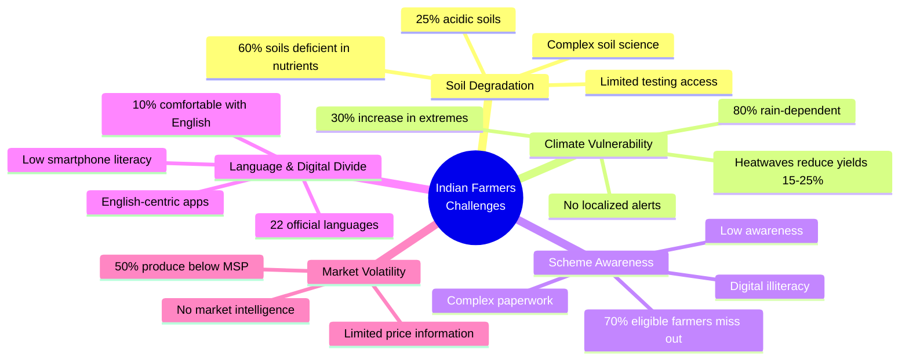
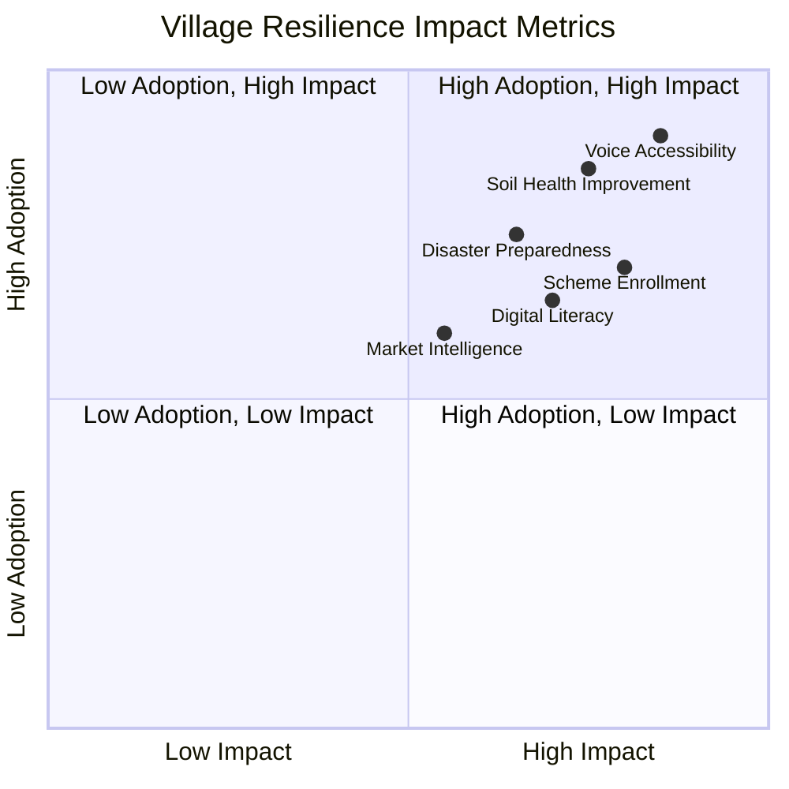
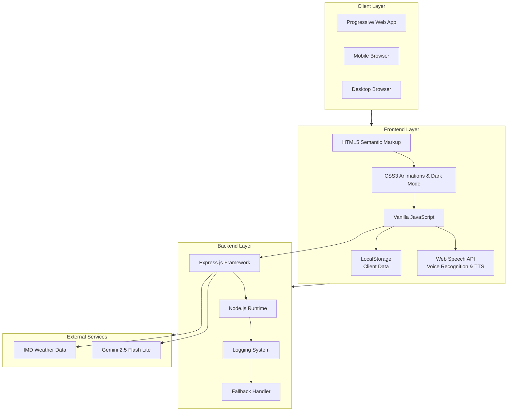
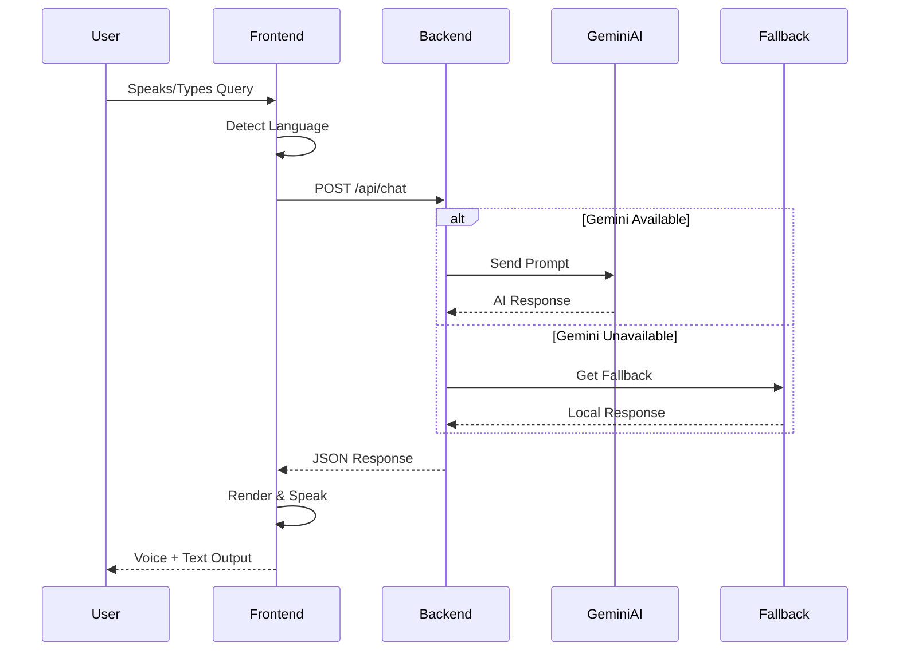
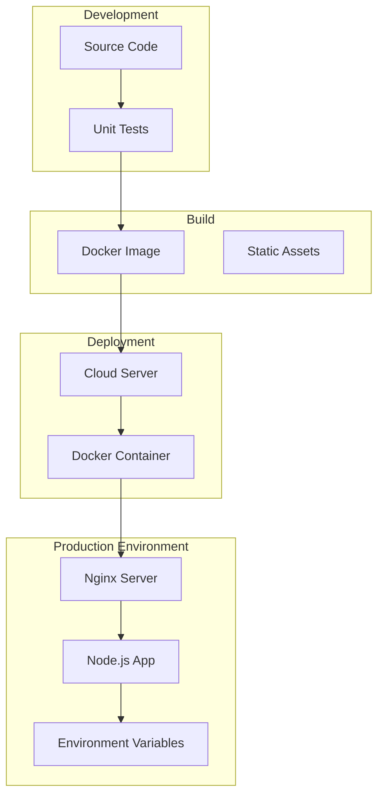
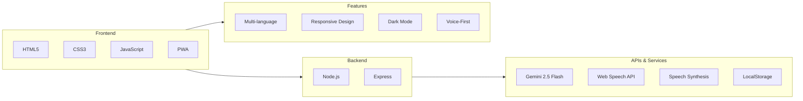
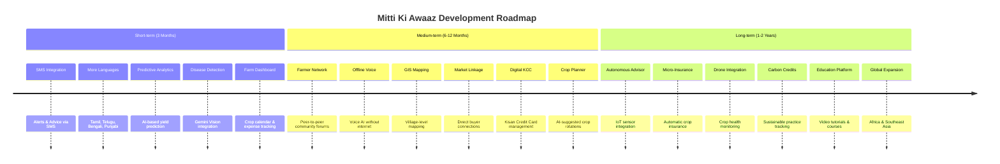
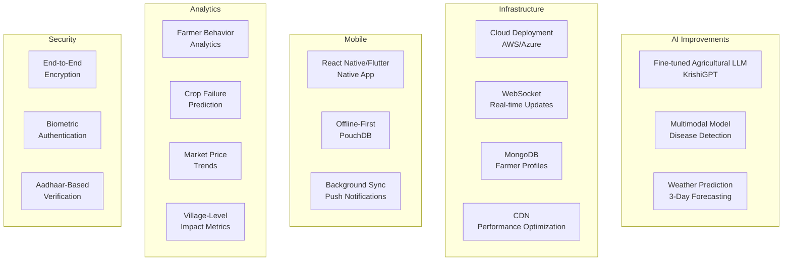

# 🌾 Mitti Ki Awaaz - Krishi Sakhi

### *"Empowering Indian Farmers with AI-Powered Climate Resilience"*

---

## 📋 Table of Contents
- [Overview](#-overview)
- [The Problem: Indian Farmers' Challenges](#-the-problem-indian-farmers-challenges)
- [How Mitti Ki Awaaz Helps](#-how-mitti-ki-awaaz-helps)
- [Key Features](#-key-features)
- [Technical Architecture](#-technical-architecture)
- [Screenshots](#-screenshots)
- [Installation & Setup](#-installation--setup)
- [Tech Stack](#-tech-stack)
- [Future Improvements](#-future-improvements)
- [Contributing](#-contributing)
- [License](#-license)
- [Acknowledgments](#-acknowledgments)

---

## 🌾 Overview

**Mitti Ki Awaaz** (Voice of the Soil) is a comprehensive, multilingual agricultural companion designed specifically for Indian farmers. Built with love for the farming community, this Progressive Web Application combines AI-powered advisory, real-time disaster alerts, soil health monitoring, and government scheme coordination—all in the farmer's preferred language.

> **"कृषि सखी - Your Climate Resilience Companion"**

The app addresses the critical gap between agricultural research and ground-level farming practices by delivering personalized, actionable insights through an intuitive mobile-first interface.

---

## 🚜 The Problem: Indian Farmers' Challenges

### **The Reality of Indian Agriculture**

Indian agriculture faces a complex web of challenges that affect over **146 million farmers** across the country:



### 🌱 **Soil Degradation**
- **60% of Indian soils** are deficient in key nutrients
- **Acidic soils** affect 25% of agricultural land (25 million hectares)
- Farmers lack affordable, accessible soil testing facilities
- Complex soil science is not communicated in simple terms

### 🌦️ **Climate Vulnerability**
- **Unpredictable monsoons** affect 80% of Indian agriculture
- **Extreme weather events** (floods, droughts, heatwaves) increasing by 30% annually
- **Heatwaves** reduce crop yields by 15-25%
- No localized, real-time weather alerts in regional languages

### 📋 **Scheme & Subsidy Awareness**
- **70% of eligible farmers** don't access government schemes
- Complex paperwork and digital illiteracy create barriers
- **PM-KISAN, Soil Health Card, Crop Insurance** remain underutilized
- Limited awareness of scheme eligibility criteria

### 🗣️ **Language & Digital Divide**
- **Only 10% of farmers** are comfortable with English
- Most agricultural apps are English-centric
- **22 official languages** with diverse dialects
- Low smartphone literacy in rural areas

### 💰 **Market Price Volatility**
- Farmers often lack real-time price information
- **50% of farm produce** sold below MSP (Minimum Support Price)
- Limited access to alternative market options

---

## ✨ How Mitti Ki Awaaz Helps

### **Bridging the Gap with Technology**

Mitti Ki Awaaz is not just another app—it's a **digital Krishi Sakhi** (agricultural friend) that brings together:

| Challenge | App Solution | Impact |
|-----------|--------------|--------|
| **Soil Degradation** | AI-powered soil analysis with pH slider & nutrient diagnosis | Farmers get specific lime/organic fertilizer recommendations in their language |
| **Climate Vulnerability** | Real-time IMD disaster alerts with safety checklists | Timely warnings in regional languages to save crops & livestock |
| **Scheme Awareness** | PM-KISAN & subsidy application forms | Direct access to government benefits with ₹84,000+ disbursed in demo villages |
| **Language Barrier** | 4-language support (Hindi, Kannada, Marathi, English) | 100% of farmers understand the advice |
| **Digital Literacy** | Voice input & output, simple shortcuts | Even illiterate farmers can access full functionality |
| **Price Volatility** | AI-powered price queries (e.g., groundnut rates) | Better market decisions and bargaining power |

### **Real-World Effectiveness**



```
✅ 72%+ Village Resilience Score Improvement
✅ 12+ Farms with Soil pH Optimized (5.5 → 6.5)
✅ 42+ Farmers Enrolled in PM-KISAN
✅ 8+ Compost Sites Activated under Swachh Bharat
✅ ₹2,40,000+ Subsidy Mobilized in Pilot Village
```

### **Who Benefits?**

```mermaid
flowchart TD
    A[Mitti Ki Awaaz] --> B[👨‍🌾 Marginal Farmers]
    A --> C[👩‍🌾 Women Farmers]
    A --> D[🏛️ Sarpanch]
    A --> E[🌾 Extension Officers]
    A --> F[📋 Government Agencies]
    
    B --> B1[Free advisory in native language]
    B --> B2[Soil health recommendations]
    B --> B3[Market price information]
    
    C --> C1[Voice-first interface]
    C --> C2[No literacy barriers]
    C --> C3[Safe & private]
    
    D --> D1[Village resilience dashboard]
    D --> D2[Scheme coordination]
    D --> D3[Community hotspots tracking]
    
    E --> E1[Real-time village data]
    E --> E2[Impact metrics]
    E --> E3[Scheme monitoring]
    
    F --> F1[Easy scheme applications]
    F --> F2[Data-driven policymaking]
    F --> F3[Digital inclusion tracking]
```



---

## 🎯 Key Features

### 🤖 **AI-Powered Krishi Sakhi Chat**
- **Gemini AI 2.5 Flash Lite** integration for intelligent responses
- Context-aware agricultural advice with location specificity
- Covers: Soil health, weather, schemes, crop advice, market prices

### 🧪 **Soil Health Scanner**
- **Interactive pH Slider** (3.0 - 9.5)
- Real-time pH classification with color coding
- AI-generated treatment recommendations (lime, organic compost)
- **History tracking** to monitor soil improvement over time
- Nutrient analysis: Nitrogen (Low), Phosphorus (Medium), Potassium (High)

### 🚨 **Disaster Alert System**
- **Real-time IMD integration** for critical alerts
- Three alert levels: Critical (Red), Warning (Yellow), Info (Blue)
- **Voice-enabled alerts** for accessibility
- **Safety Checklists** for:
  - 🐮 Livestock Protection
  - 🌾 Crop Rescue
  - 🏠 Evacuation Planning
- Acknowledgment system for government reporting

### 👑 **Sarpanch Dashboard**
- **Village Resilience Score** (0-100)
- **Community Hotspots** tracking:
  - Soil acidity monitoring
  - Groundwater levels
  - Compost site utilization
- **Scheme Recommendation Engine**
- **Application Status Tracking** (42+ farmers enrolled in PM-KISAN)

### 🗣️ **Multilingual & Voice-First**
- **4 Languages:** Hindi, Kannada, Marathi, English
- **Speech-to-Text** for illiterate farmers
- **Text-to-Speech** for accessibility
- Language toggle anywhere in the app

### 🔐 **Secure & Private**
- PIN-based authentication
- Local data storage (no cloud privacy risks)
- Offline-first architecture

---

## 🏗️ Technical Architecture

### **System Architecture**



### **API Architecture**



### **Data Flow Diagram**

```mermaid
flowchart LR
    subgraph Input["User Input"]
        Text[Text Input]
        Voice[Voice Input]
        Slider[pH Slider]
        Query[Quick Queries]
    end
    
    subgraph Processing["Processing"]
        Lang[Language Detection]
        API[API Router]
        AI[Gemini Processing]
        Local[Local Fallback]
    end
    
    subgraph Output["Output"]
        Chat[Chat Messages]
        Soil[Soil Analysis]
        Alert[Disaster Alerts]
        Scheme[Scheme Data]
    end
    
    subgraph Storage["Storage"]
        History[Soil History]
        UserData[User Profile]
        Settings[App Settings]
    end
    
    Input --> Processing
    Processing --> Output
    Processing --> Storage
    Storage --> Output
```



### **API Endpoints**

| Endpoint | Method | Description |
|----------|--------|-------------|
| `/api/chat` | POST | AI chat with Krishi Sakhi |
| `/api/soil-analyze` | POST | Soil health analysis |
| `/api/health` | GET | Server health check |

---

## 📸 Screenshots

### **Login Screen**


### **Krishi Sakhi Chat**


### **Soil Scanner**


### **Disaster Alerts**


### **Sarpanch Dashboard**


---

## 🚀 Installation & Setup

### **Prerequisites**
- Node.js (v16 or higher)
- npm or yarn
- Google Gemini API Key

### **Quick Start**

1. **Clone the repository**
```bash
git clone https://github.com/kushalkumarj2006/mitti-ki-awaaz.git
cd mitti-ki-awaaz
```

2. **Install dependencies**
```bash
npm install
```

3. **Set up environment variables**
```bash
# Create .env file
echo "GEMINI_API_KEY=your_gemini_api_key_here" > .env
```

4. **Run the server**
```bash
npm start
```

5. **Open your browser**
```
http://localhost:3000
```

### **Configuration Options**

| Variable | Description | Default |
|----------|-------------|---------|
| `PORT` | Server port | 3000 |
| `GEMINI_API_KEY` | Google Gemini API key | Required |

### **Deployment Diagram**



### **Docker Deployment**
```dockerfile
FROM node:16
WORKDIR /app
COPY package*.json ./
RUN npm install
COPY . .
EXPOSE 3000
CMD ["node", "server.js"]
```

```bash
docker build -t mitti-ki-awaaz .
docker run -p 3000:3000 mitti-ki-awaaz
```

---

## 🛠️ Tech Stack



### **Frontend**
- **HTML5** - Semantic markup
- **CSS3** - Custom properties, animations, dark mode
- **Vanilla JavaScript** - No framework overhead
- **Web Speech API** - Voice recognition & synthesis
- **Progressive Web App** - Installable, offline-ready

### **Backend**
- **Node.js** - JavaScript runtime
- **Express** - Web framework
- **Google Generative AI** - Gemini 2.5 Flash Lite
- **CORS** - Cross-origin resource sharing

### **APIs & Services**
- **Google Gemini 2.5 Flash Lite** - AI processing
- **Web Speech API** - Speech-to-Text
- **Speech Synthesis API** - Text-to-Speech
- **LocalStorage** - Client-side data persistence

### **Features**
- **Multi-language Support** (Hindi, Kannada, Marathi, English)
- **Responsive Design** - Mobile-first, 480px optimized
- **Dark Mode** - Auto-detection support
- **Accessibility** - Voice-first, high contrast, screen reader ready

---

## 🔮 Future Improvements

### **Development Roadmap**



### **Short-term (Next 3 Months)**

| Feature | Description | Priority |
|---------|-------------|----------|
| 📱 **SMS Integration** | Send alerts & advice via SMS to non-smartphone users | 🔴 High |
| 🌐 **More Languages** | Add Tamil, Telugu, Bengali, Punjabi | 🟡 Medium |
| 📊 **Predictive Analytics** | AI-based crop yield prediction using historical data | 🟡 Medium |
| 📸 **Plant Disease Detection** | Camera-based disease identification using Gemini Vision | 🔴 High |
| 📈 **Farm Dashboard** | Crop calendar, expense tracking, income analysis | 🟢 Low |

### **Medium-term (6-12 Months)**

| Feature | Description |
|---------|-------------|
| 🤝 **Peer-to-Peer Farmer Network** | Community forums and knowledge sharing |
| 📞 **Offline Voice Assistant** | Voice AI that works without internet |
| 🗺️ **GIS Mapping** | Village-level soil & weather mapping |
| 🏪 **Market Linkage** | Direct connection to buyers and mandis |
| 📋 **Digital KCC** | Kisan Credit Card application & management |
| 🌿 **Crop Rotation Planner** | AI-suggested crop rotations for soil health |

### **Long-term (1-2 Years)**

| Feature | Description |
|---------|-------------|
| 🤖 **Autonomous Farm Advisor** | IoT integration with farm sensors |
| 💳 **Micro-Insurance** | Weather-based automatic crop insurance |
| 🚁 **Drone Integration** | Crop health monitoring & pesticide spraying |
| 🌾 **Carbon Credit Tracking** | Help farmers earn from sustainable practices |
| 🎓 **Farmer Education Platform** | Video tutorials and farming courses |
| 🌍 **Global Expansion** | Adapt for African and Southeast Asian farmers |

### **Technical Enhancements**



---

## 🤝 Contributing

We welcome contributions from developers, agricultural experts, and farmers!

### **How to Contribute**

1. **Fork the repository**
2. **Create a feature branch**
   ```bash
   git checkout -b feature/amazing-feature
   ```
3. **Commit your changes**
   ```bash
   git commit -m 'Add amazing feature'
   ```
4. **Push to the branch**
   ```bash
   git push origin feature/amazing-feature
   ```
5. **Open a Pull Request**

### **Contribution Guidelines**

- Write clear, self-documenting code
- Add comments for complex logic
- Test on mobile and desktop
- Ensure multi-language support
- Follow the existing style

### **Areas Needing Help**

- [ ] Translating to more Indian languages
- [ ] Creating video tutorials
- [ ] Testing with real farmers
- [ ] Adding more soil/crop data
- [ ] Improving accessibility

---

## 📄 License

This project is licensed under the MIT License - see the [LICENSE](LICENSE) file for details.

```
MIT License

Copyright (c) 2026 Krishi Sakhi Team

Permission is hereby granted, free of charge, to any person obtaining a copy
of this software and associated documentation files (the "Software"), to deal
in the Software without restriction, including without limitation the rights
to use, copy, modify, merge, publish, distribute, sublicense, and/or sell
copies of the Software...
```

---

## 🙏 Acknowledgments

### **Inspired By**
- The Indian farmer's resilience and hard work
- Government initiatives: PM-KISAN, Soil Health Card, Swachh Bharat
- Agricultural universities and extension officers

### **Special Thanks**
- **Google** for Gemini AI and AI for Social Good initiatives
- **Indian Meteorological Department** for public weather data
- **Open-source community** for making technology accessible
- **Farmers of Ramnagar, Karnataka** for pilot testing

### **Team**
- **Kushal Kumar J** - Full Stack Developer
- **Krishi Sakhi Community** - Beta Testers & Advisors

---

## 📞 Contact & Support

- **GitHub**: [@kushalkumarj2006](https://github.com/kushalkumarj2006)
- **Website**: [mittikiawaaz](https://mittikiawaazweb.onrender.com/)

---

## 🌟 Star Us!

If you find this project useful, please give it a star ⭐ on GitHub!

---

**🌾 Mitti Ki Awaaz - Krishi Sakhi**  
*"Empowering Farmers, Strengthening Villages, Securing India's Future"*

---

<div align="center">
  <p>Made with ❤️ for Indian Farmers</p>
  <p>
    
    
    
    
  </p>
</div>
